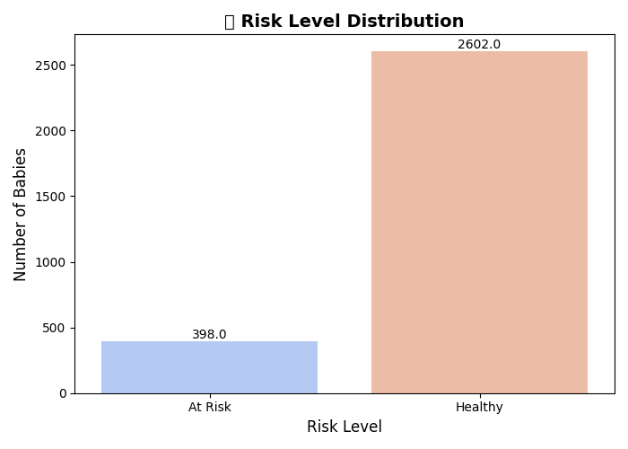
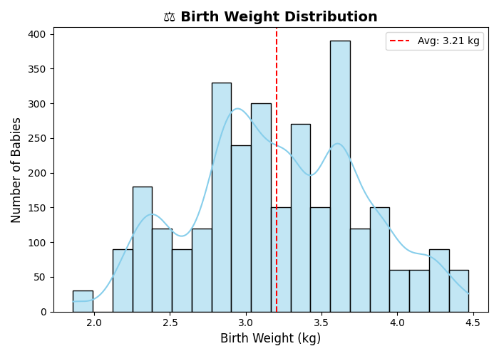

# 🍼 Newborn Health Insights Report

*Hospital:* **City Neonatal Center**  
*Year:* **2025**

This report summarizes key findings from the newborn dataset.

## 📊 Key Statistics
- Total cases: **3000**
- Average birth weight: **3.21 kg**
- Average gestational age: **38.9 weeks**
- Average APGAR score: **8.4**
- Most common risk level: **Healthy**

## 🧾 Risk Level Distribution
| Risk Level | Count |
|-----------|-------|
| Healthy | 2602 |
| At Risk | 398 |

## 📈 Visualizations

